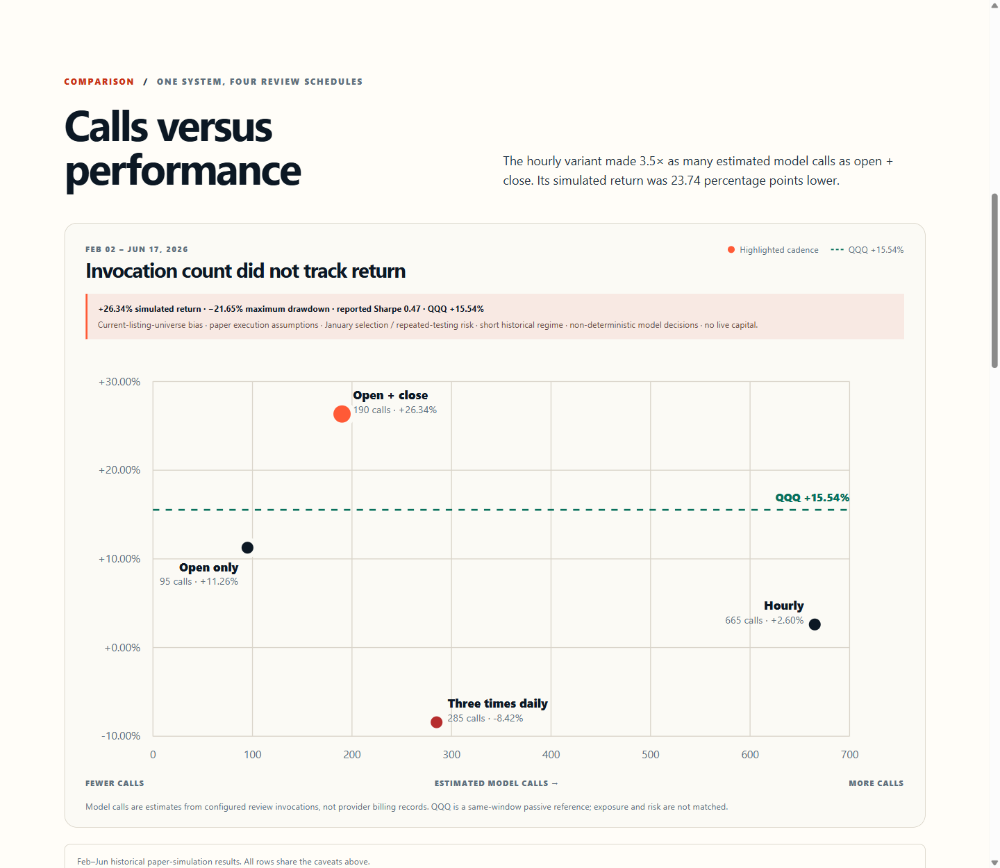
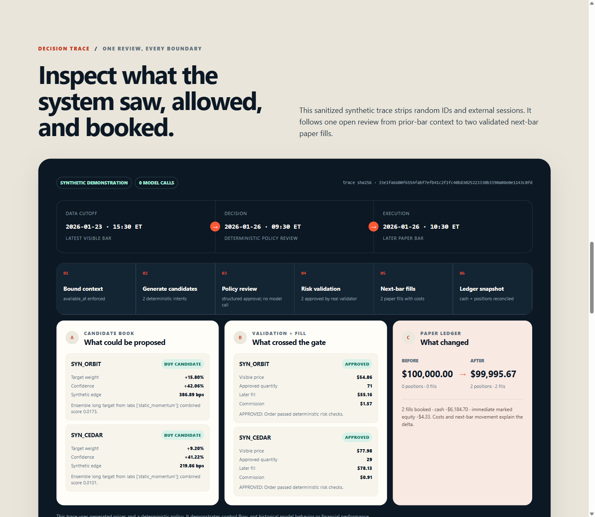
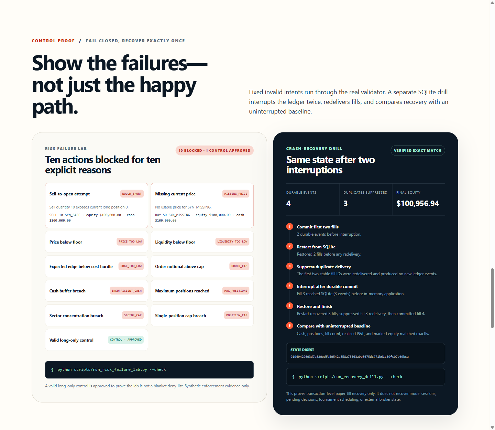

# FINANCEBOT

**A quantitative-research and agent-evaluation case—not an investment product.**

FINANCEBOT tests a specific systems question: does calling a model more often improve its simulated trading decisions? Model or policy judgment can propose structured intents, but timestamp handling, risk approval, execution, and accounting remain deterministic.

> **Observed in this simulator:** open + close review produced a higher simulated return and a shallower maximum drawdown than hourly review during the Feb–Jun comparison while using 475 fewer estimated model calls. This is caveated historical simulation evidence, not evidence of a general market edge.



## Result at a glance

**Historical paper simulation · 2026-02-02 through 2026-06-17 · no live capital**

| Variant | Review schedule | Simulated return | QQQ reference | Max drawdown | Reported Sharpe* | Fills | Estimated model calls |
|---|---|---:|---:|---:|---:|---:|---:|
| Open only | 09:30 ET | +11.26% | +15.54% | -35.31% | 0.29 | 80 | 95 |
| **Open + close** | **09:30 and 15:30 ET** | **+26.34%** | **+15.54%** | **-21.65%** | **0.47** | **94** | **190** |
| Three times daily | 09:30, 12:30, 15:30 ET | -8.42% | +15.54% | -26.85% | -0.03 | 147 | 285 |
| Hourly | Every market-hour bar | +2.60% | +15.54% | -29.58% | 0.16 | 86 | 665 |

The highlighted +26.34% result must always travel with these limitations:

- **current-listing-universe bias** rather than point-in-time historical membership;
- **paper execution assumptions** for fills, costs, slippage, liquidity, and timing;
- **January selection and repeated-testing risk** before the Feb–Jun comparison;
- a **short historical regime** from February through mid-June;
- **non-deterministic model decisions** that may differ on rerun;
- **no live capital** or broker-confirmed execution.

QQQ is a same-window passive reference, not a matched-risk control. SPY returned +6.84% over the same dates. January was a five-variant selection arena; it was not merged into the Feb–Jun comparison.

\* “Reported Sharpe” preserves the repository implementation: √252 × mean / population standard deviation of per-snapshot returns. Because snapshots are intraday, this is retained for relative comparison rather than presented as conventional hourly annualization.

## Why this is a useful agent-system case

The interesting result is not the headline return. It is that simulated portfolio outcomes did not improve monotonically with invocation volume in this experiment:

- open + close: **190 calls, +26.34% simulated return**;
- hourly: **665 calls, +2.60% simulated return**.

Hourly review created 475 more estimated invocation opportunities than open + close without producing a better simulated outcome here; provider cost was not directly measured. FINANCEBOT makes cadence measurable alongside fills, drawdown, benchmark references, and failures instead of assuming more agent activity is inherently useful.

## Architecture


1. A replay engine advances a timestamp-bounded daily/hourly clock.
2. Deterministic labs and an optimizer create long-only candidates.
3. A model agent or deterministic policy returns structured decisions.
4. `RiskValidator` applies cash, price, liquidity, exposure, sector, and no-short constraints.
5. Approved requests fill only on a later paper bar with explicit costs/slippage.
6. The paper ledger records cash, positions, fills, and portfolio snapshots; a SQLite hash-chain journal can restore stable paper-fill IDs exactly once.
7. Tournament orchestration compares fixed review schedules and aggregate metrics.

The model never owns time advancement, risk limits, or accounting. In default showcase mode, broker connections/submission/reconciliation, external model runtimes, and network price downloads are blocked before side effects.

See [architecture and data flow](docs/architecture.md), [inspectability and recovery evidence](docs/inspectability-and-recovery.md), [methodology and limitations](docs/evidence-and-limitations.md), and the [problem/market thesis](docs/problem-and-market.md).

## Inspectability and failure evidence

The local dashboard goes beyond aggregate results:

- **Decision trace:** one sanitized synthetic open review shows the prior-bar cutoff, deterministic candidates, structured policy approval, real validator output, later fill prices, costs, and before/after ledger state. Random IDs and model sessions are excluded; the trace has a reproducible SHA-256 digest.
- **Risk failure lab:** ten fixed invalid intents are rejected by the real validator for sell-to-open, missing price, low price, low liquidity, weak edge, oversized order, insufficient cash, maximum positions, sector concentration, and single-position concentration. A valid control is approved.
- **Recovery drill:** a standard-library SQLite journal is interrupted twice. Three duplicate deliveries are suppressed, four durable fill events verify through a hash chain, and the restored paper ledger exactly matches an uninterrupted baseline.





Recovery scope is deliberately narrow: this proves transaction-level paper-fill restoration, not pending-decision, model-session, tournament-scheduler, or external broker-state recovery.

## Fast offline replay

The committed fixture is labeled **Synthetic demonstration**. It contains five generated mathematical price series, no observed market data, no paid API dependency, and no broker path. Its returns have no financial meaning and do not reproduce the historical tournament.

### Setup

```bash
python -m venv .venv
# Windows PowerShell: .venv\Scripts\Activate.ps1
# macOS/Linux: source .venv/bin/activate
python -m pip install -e ".[dev]"
```

### Run and verify

```bash
python scripts/generate_sample_data.py --check
python scripts/run_showcase_replay.py --check
python scripts/run_risk_failure_lab.py --check
python scripts/run_recovery_drill.py --check
python scripts/check_showcase_safety.py
python scripts/freeze_protocol.py --check
python scripts/validate_package.py
python -m pytest -q --ignore=tests/showcase  # curated 47-test suite
python -m pytest -q                         # all 61 tests
```

Expected test result: **61 passed** — the curated original 47-test suite plus 14 showcase, trace, risk, recovery, data, and safety checks. The completed run record is in [`docs/verification.md`](docs/verification.md).

To regenerate the committed deterministic artifact intentionally:

```bash
python scripts/generate_sample_data.py
python scripts/run_showcase_replay.py
python scripts/run_risk_failure_lab.py
python scripts/run_recovery_drill.py
```

### Open the results dashboard

From the repository root:

```bash
python -m http.server 8000
```

Open <http://127.0.0.1:8000/dashboard/>. The interface reads only local aggregate evidence, trace, failure-lab, recovery, protocol, and replay JSON.

Additional captures are in [`docs/screenshots/`](docs/screenshots/): the evidence-bounded hero, calls-versus-performance view, decision trace, and risk/recovery controls.

## Prospective paper-only gate

[`protocol/frozen-paper-v1.json`](protocol/frozen-paper-v1.json) freezes a proposed open + close protocol: review times, universe, model/runtime, candidate policy, risk limits, fill assumptions, costs, metrics, and change control. Its SHA-256 configuration digest is checked by `scripts/freeze_protocol.py`.

Status: **proposed, not started, and not authorized for activation**. Activation also requires a declared authorized data source, integration of the verified fill journal into the prospective runner, durable pending-decision/tournament checkpoints, and a future paper-only window. Missing the planned start invalidates this version; outcomes cannot be moved to a replacement window retroactively.

## Repository map

```text
artifacts/                 replay trace, failure-lab, and recovery summaries
dashboard/                 local results interface
data/synthetic/            generated sample prices + hash manifest
docs/                      case-study reports, diagrams, screenshots, demo script
evidence/                  sanitized aggregate tournament rows
protocol/                  frozen prospective paper-only configuration
scripts/                   generation, replay, failure, recovery, safety, and protocol checks
shared/schemas/            structured intent/audit/proposal schemas
src/myaibot/               curated replay, agent, risk, ledger, and research code
tests/                     47 curated tests + 14 showcase/recovery checks
```

## Evidence boundaries

The public package intentionally excludes source market datasets, raw model calls/responses, sessions, account or broker data, live orders, credentials, caches, logs, and generated dependencies. Historical aggregate rows are traceable to source leaderboards in [`PROVENANCE.md`](PROVENANCE.md), but the private/raw data needed to reproduce the Feb–Jun headline is not published here.

State recovery remains partial. The SQLite fill journal now demonstrates atomic append, stable-ID idempotency, hash-chain verification, and exact paper-ledger restoration after interruption. It is not yet wired into the tournament runner and does not persist pending decisions, model sessions, schedule state, or external broker state.

## Authorship and upstream systems

My contribution is the experiment thesis, architecture, agent/risk/ledger integration, tournament design, implementation, and interpretation preserved from the source project. I completed the portfolio closure, safety guard, synthetic demo, decision trace, failure lab, SQLite recovery drill, dashboard, diagrams, and documentation with AI assistance. Pi, OpenAI models, pandas, NumPy, Pydantic, PyYAML, and pytest are third-party systems; I do not claim authorship of them.

## License

Licensed under the [Apache License 2.0](LICENSE). Third-party dependencies and model/runtime integrations remain subject to their own licenses and terms.

This repository is public-source only. Deployment, broker connection, order placement, activation of the prospective protocol, and communication of financial expectations remain unauthorized.
