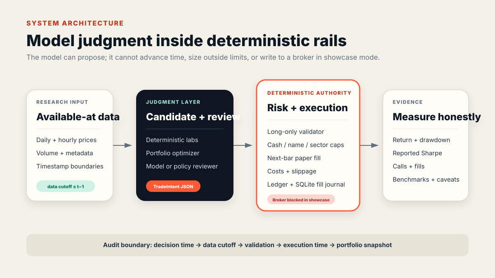
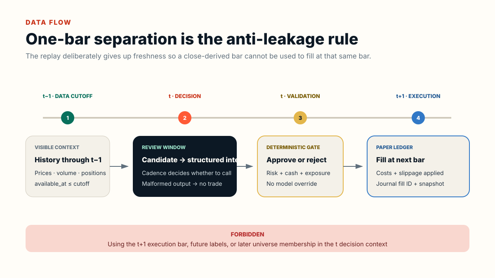
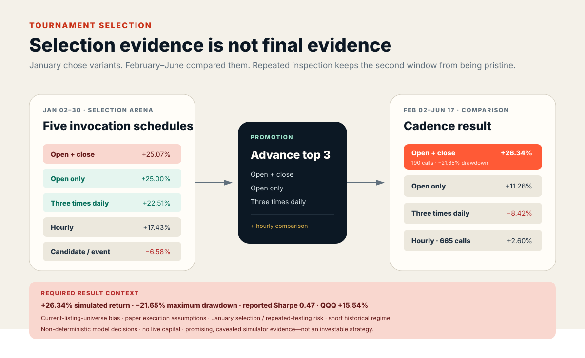
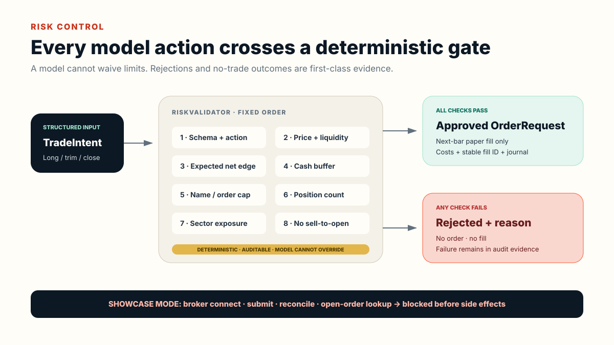

# Architecture and data flow

## System architecture



FINANCEBOT separates non-deterministic judgment from deterministic authority.

### Timestamp and replay layer

`src/myaibot/backtest/replay.py` and `hourly_replay.py` advance the simulation clock. The hourly engine builds context from the prior visible bar, records decision/data/execution timestamps, and fills an approved order only on a later bar.

### Candidate and portfolio layer

Labs under `src/myaibot/labs/` emit typed `TradeSignal` records. `EnsemblePortfolioManager` combines scores into bounded target weights and candidate `TradeIntent` records. This layer is deterministic.

### Agent layer

`HourlyTradingAgent` exposes one decision interface with two modes:

- deterministic policy mode for regression and offline demonstration;
- Pi/model mode for source research runs.

The model returns structured approvals, rejections, close requests, new long-only intents, or no trade. Malformed/failed output becomes no trade. In the public package, model invocation is blocked while default showcase mode is active.

### Risk and execution layer

`RiskValidator` converts an intent into either a rejected `ValidationResult` or bounded `OrderRequest`. It enforces action, price, liquidity, expected-edge, cash-buffer, order-notional, position, position-count, and sector limits. `PaperLedger` applies the later price, transaction cost, slippage, cash movement, positions, and realized P&L.

`SQLiteFillJournal` is a separate durable paper-fill boundary. Every event stores a stable fill ID, idempotency key, canonical payload digest, previous hash, and event hash in one SQLite transaction. Identical redelivery is a no-op; conflicting reuse fails closed. Restore verifies the complete chain before rebuilding `PaperLedger`.

`ibkr_adapter.py` preserves the isolated source boundary for architectural inspection, but connect/disconnect/submit/reconcile/open-order calls raise before side effects in showcase mode. The showcase dependency set does not install `ib_async`.

### Evidence layer

Equity snapshots feed total return, maximum drawdown, reported Sharpe, and benchmark helpers. Tournament orchestration adds variant identity, schedule, calls, fills, and state. The public package retains sanitized aggregate rows plus three generated inspectability artifacts: a decision trace, validator failure lab, and interrupted recovery drill.

## Timestamp-safe data flow



The central invariant is:

```text
data_cutoff < execution_time
```

For an hourly decision at `t`, visible data ends at `t−1`; an approved order uses the next replay bar `t+1`. This is conservative and can reduce freshness, but prevents a close-derived bar from being both evidence and fill price.

The contracts also carry `available_at` fields for evidence. Full source-data lineage is excluded, so the portfolio copy demonstrates the code boundary rather than proving every historical source timestamp.

## Tournament selection



The tournament is a two-stage process:

1. January compares five schedules and promotes three.
2. February–June compares the promoted three and retains hourly as a high-frequency reference.

Because January selected winners and later results were inspected, the second stage is described as a post-selection comparison rather than pristine final validation.

## Risk-control cascade



Risk validation is ordered and deterministic. It covers action semantics, price, liquidity, expected edge, cash buffer, concentration, position count, sector exposure, and no sell-to-open. A rejected intent generates evidence; it does not disappear.

The validator reduces operational risk but does not validate the investment thesis, data quality, or prospective performance. `artifacts/risk-failure-lab.json` proves ten rejection paths with fixed synthetic intents and includes one approved control so the demonstration is not a blanket deny-list.

## Sanitized decision trace

The committed trace inside `artifacts/sample-replay.json` selects the first filled open + close review and preserves only deterministic fields:

```text
data cutoff → candidates → policy decision → validation → later fills → ledger delta
```

Random decision, signal, intent, order, fill, and audit IDs are omitted. Dynamic creation timestamps and raw model/session material are also omitted. The remaining payload is canonicalized and SHA-256 hashed. This makes the trace reproducible while still exposing visible prices, proposed targets, validator outcomes, execution prices, costs, and before/after ledger state.

The trace is synthetic policy behavior. It does not claim to reproduce a historical model decision.

## State and recovery

The system has three different kinds of state:

1. **Replay state:** in-memory events, decisions, validations, fills, and snapshots; optional partial JSON writes.
2. **Tournament state:** coarse completed-variant rows and usage-limit heartbeat files.
3. **Model state:** optional external runtime sessions, excluded from the public package.

The portfolio extension closes one part of this gap:

- `SQLiteFillJournal.append_fill()` performs a serialized SQLite transaction and atomically advances event count and chain head;
- repeated delivery of the same fill ID or idempotency key is suppressed;
- reuse with different content raises `JournalConflictError`;
- payload, sequence, links, event hashes, event count, and final head are verified before restore;
- `restore_ledger()` rebuilds an in-memory `PaperLedger` exactly once from verified events.


The committed drill applies four fixed fills to an uninterrupted baseline, then interrupts the journal twice—including once after durable commit but before in-memory application. Three redeliveries are suppressed. Restored cash, positions, fill count, realized P&L, and final marked equity have the same digest as the baseline.

This is **transaction-level paper-fill recovery**, not complete system recovery. The journal is not yet wired into tournament orchestration; pending decisions, model sessions, invocation scheduling, partial context construction, and external broker state remain outside its scope. The prospective protocol still requires durable decision/tournament checkpoints and runner integration.

## Showcase execution path

```text
data/synthetic/*.csv
  → scripts/run_showcase_replay.py
  → StaticMomentumLab
  → EnsemblePortfolioManager
  → deterministic HourlyTradingAgent policy
  → RiskValidator
  → PaperLedger
  → sanitized decision trace
  → artifacts/sample-replay.json

fixed invalid intents
  → RiskValidator
  → artifacts/risk-failure-lab.json

fixed fill stream
  → SQLiteFillJournal
  → interrupt / restore / redeliver
  → PaperLedger state comparison
  → artifacts/recovery-drill.json
```

Every demonstration sets showcase mode on, uses generated inputs, makes zero external model calls and broker connections, and compares a fresh deterministic result byte-for-byte with its committed JSON.
