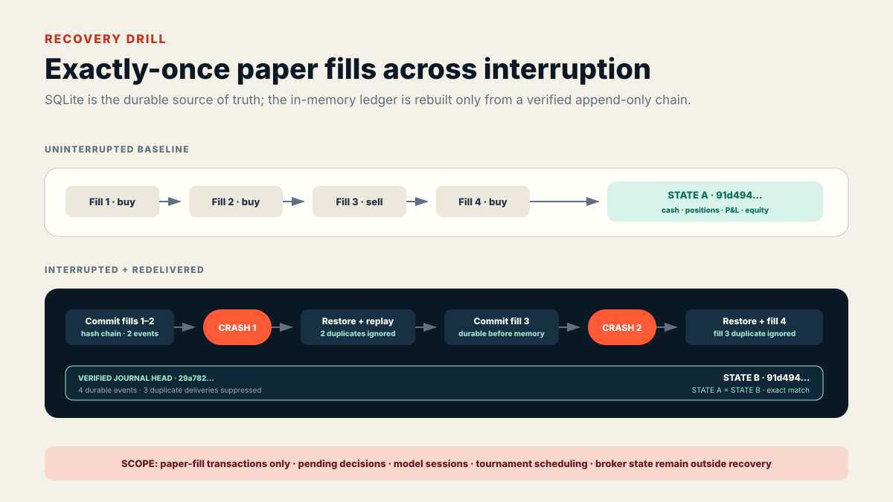

# Inspectability and recovery evidence

This report covers three generated, offline proofs added to the curated FINANCEBOT package. None reproduces historical model behavior or implies financial performance.

## 1. Sanitized decision trace

**Artifact:** `artifacts/sample-replay.json` → `decision_trace`

**Generator:** `scripts/run_showcase_replay.py`

The trace selects the first synthetic open + close review that produced paper fills. It preserves:

1. latest visible data cutoff;
2. decision time;
3. deterministic candidate fields;
4. structured policy decision;
5. real `RiskValidator` outcomes;
6. later execution timestamp and paper prices;
7. commission/slippage fields;
8. before/after paper-ledger state.

The required ordering is checked:

```text
data_cutoff < decision_time < execution_time
```

### Sanitization

The artifact removes random signal, decision, intent, order, fill, and audit IDs. It also removes dynamic object-creation timestamps, raw prompts/responses, sessions, and model history. Candidate scores, visible prices, validator messages, later fills, and ledger values remain because they are deterministic on the generated fixture.

The sanitized trace is canonicalized with sorted compact JSON and recorded as `trace_sha256`. `--check` reruns the replay and compares the entire committed artifact byte-for-byte.

### Boundary

The trace uses the deterministic `approve_all` policy and generated mathematical prices. It demonstrates system control flow—not the reasoning quality or reproducibility of the historical model agent.

## 2. Deterministic risk failure lab

**Artifact:** `artifacts/risk-failure-lab.json`

**Generator:** `scripts/run_risk_failure_lab.py`

Every case constructs a strict `TradeIntent`, `PortfolioState`, and `MarketSnapshot`, then calls the real `RiskValidator`. Expected rejection codes are asserted before the artifact is written.

| Synthetic case | Deterministic result |
|---|---|
| Sell with no long holding | `WOULD_SHORT` |
| Missing current price | `MISSING_PRICE` |
| Price below configured floor | `PRICE_TOO_LOW` |
| ADV below configured floor | `LIQUIDITY_TOO_LOW` |
| Expected net edge below hurdle | `EDGE_TOO_LOW` |
| Order notional above cap | `ORDER_CAP` |
| Cash after buffer insufficient | `INSUFFICIENT_CASH` |
| Opening beyond maximum names | `MAX_POSITIONS` |
| Post-trade sector exposure above cap | `SECTOR_CAP` |
| Post-trade single-name exposure above cap | `POSITION_CAP` |
| Valid long-only control | `APPROVED` |

The approved control matters: it demonstrates selective enforcement rather than a hard-coded deny result. The order-notional case also closes an implementation gap by enforcing the existing `max_order_notional_weight` field in the validator.

This lab demonstrates configured enforcement only. It does not prove that the limits are optimal or sufficient for real financial risk.

## 3. SQLite paper-fill recovery drill

**Artifact:** `artifacts/recovery-drill.json`

**Generator:** `scripts/run_recovery_drill.py`

**Implementation:** `src/myaibot/execution/journal.py`



### Journal transaction

For each paper fill, one `BEGIN IMMEDIATE` SQLite transaction:

1. checks both the idempotency key and stable fill ID;
2. rejects conflicting content for an existing identity;
3. computes canonical fill JSON and its SHA-256 digest;
4. links the event to the previous event hash;
5. inserts the next contiguous sequence;
6. atomically advances event count and journal head.

Identical delivery returns `False` and does not mutate the journal. Conflicting delivery raises `JournalConflictError`.

### Restore verification

Before rebuilding `PaperLedger`, the journal verifies:

- contiguous sequence numbers;
- every canonical payload digest;
- every previous-hash link;
- every event hash;
- metadata event count;
- final journal head.

Payload tampering raises `JournalIntegrityError`. Only a verified stream is applied to the in-memory ledger.

### Interruption scenario

The committed drill uses four fixed synthetic fills:

1. commit fills 1–2;
2. interrupt and reopen SQLite;
3. restore two fills and suppress their redelivery;
4. durably commit fill 3, then simulate interruption before in-memory application;
5. reopen, restore three fills, suppress fill 3 redelivery, and commit fill 4;
6. restore final state and compare it with four uninterrupted fills.

The resulting cash, positions, fill count, average costs, realized P&L, market value, and marked equity match exactly. Both states have the same SHA-256 digest.

## Guarantees demonstrated

- A committed paper fill survives process restart.
- Identical stable-ID redelivery is exactly-once at the journal/restore boundary.
- Conflicting identifier reuse fails closed.
- Payload or chain tampering is detected before restore.
- SQLite connections close cleanly, including on Windows.
- The demonstration uses no external service or new dependency.

## Guarantees not demonstrated

- The replay/tournament runner is not yet wired to the journal.
- A decision accepted but not yet converted to a fill is not recovered.
- Model runtime/session state is not recovered.
- Schedule position and partially built context are not recovered.
- External broker state, partial fills, and reconciliation are not recovered.
- SQLite file loss, filesystem corruption, backup/replication, and multi-host coordination are not addressed.
- A hash chain detects modification; it is not a signed external timestamp or independent attestation.

## Verification commands

```bash
python scripts/run_showcase_replay.py --check
python scripts/run_risk_failure_lab.py --check
python scripts/run_recovery_drill.py --check
python -m pytest -q tests/showcase/test_inspectability_and_recovery.py
```

The next engineering gate is to inject the journal into the prospective runner and add a durable record for pending decisions plus tournament schedule position before activating any paper window.
